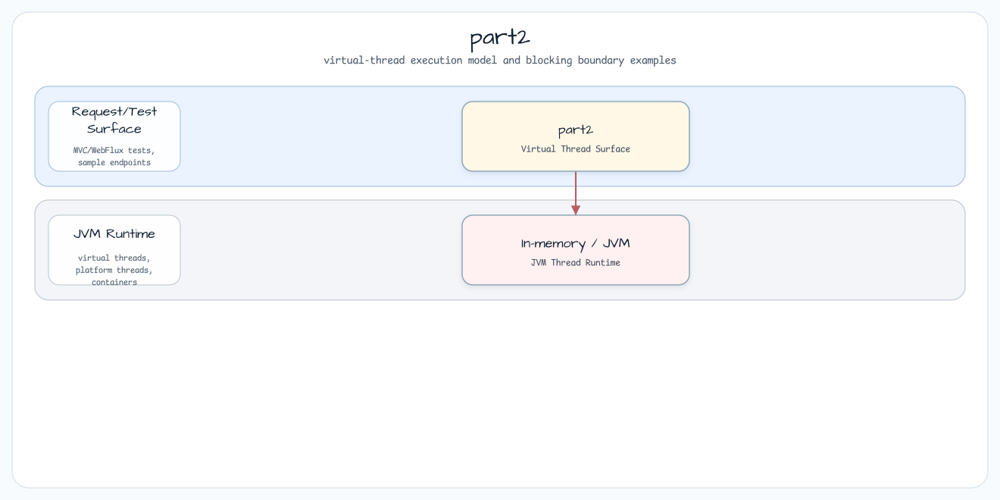

# part2

[English](README.md) | 한국어

## 예제 시나리오

이 예제는 **part2** 모듈을 실행 가능한 가상 스레드 실행 예제로 보여줍니다. 개발자가 먼저 확인할 경로인 모듈 설정, 샘플 또는 테스트 실행, 반복적인 인프라 코드를 줄이는 라이브러리 또는 프레임워크 API 사용 방식을 중심으로 설명합니다.

## 아키텍처 다이어그램



모듈은 샘플 진입점 또는 테스트 픽스처, bluetape4k 확장 계층, 예제가 사용하는 런타임 의존성으로 구성됩니다. README와 코드를 비교할 때는 `io.bluetape4k.workshop.virtualthreads` 패키지 아래의 구현을 기준으로 삼습니다.

## 흐름 다이어그램

1. `part2` 예제에 필요한 로컬 런타임을 준비합니다.
2. 예제 시나리오를 담당하는 애플리케이션, 컨트롤러, 서비스 또는 테스트 픽스처를 실행합니다.
3. 반복적인 인프라 처리는 bluetape4k 유틸리티 또는 Spring/Kotlin 통합 기능에 위임합니다.
4. 샘플 출력, HTTP 응답, 저장소 상태, metric, trace 또는 테스트 기대값으로 결과를 검증합니다.

## 시퀀스 다이어그램

핵심 시퀀스는 호출자 또는 테스트 픽스처 -> 워크샵 어댑터 -> bluetape4k 헬퍼/API -> 외부 런타임 또는 인메모리 백엔드 -> 검증/응답 순서입니다. 전용 시퀀스 이미지가 있는 모듈은 아래 이미지가 상호작용 순서를 보여주며, 없는 경우 소스 테스트가 실행 가능한 시퀀스의 기준입니다.

## 코드 예제

### 스레드당 요청 모델에서는 블로킹 동기 코드를 작성하세요

다음 비차단 비동기 코드는 가상 스레드를 사용해도 큰 이점을 얻기 어렵습니다. `CompletableFuture` 클래스가 이미 실행기의 워커 스레드를 단계 사이에서 재사용하기 때문입니다.

<sub>다음 코드는 비동기 다단계 워크플로우를 단순화한 예입니다. 먼저 오래 걸리는 두 메서드를 호출해 EUR 기준 상품 가격과 EUR/USD 환율을 가져옵니다. 그 결과로 순 상품 가격을 계산한 뒤, 순 상품 가격을 받아 세금 금액을 반환하는 세 번째 장기 실행 메서드를 호출합니다. 마지막으로 순 가격과 세금 금액으로 총 상품 가격을 계산합니다.</sub>

```java
public void useAsynchronousCode() throws InterruptedException, ExecutionException {
    CompletableFuture.supplyAsync(this::readPriceInEur)
            .thenCombine(CompletableFuture.supplyAsync(this::readExchangeRateEurToUsd), (price, exchangeRate) -> price * exchangeRate)
            .thenCompose(amount -> CompletableFuture.supplyAsync(() -> amount * (1 + readTax(amount))))
            .whenComplete((grossAmountInUsd, t) -> {
                if (t == null) {
                    assertEquals(108, grossAmountInUsd.intValue());
                } else {
                    fail(t);
                }
            })
            .get();
}
```

다음 블로킹 동기 코드는 이전의 복잡한 코드와 같은 시간에 같은 값을 반환하면서도 훨씬 단순하므로, 가상 스레드를 사용할 때 이점을 얻습니다.

```java
public void useSynchronousCode() throws InterruptedException, ExecutionException {
    try (var executorService = Executors.newVirtualThreadPerTaskExecutor()) {
        Future<Integer> priceInEur = executorService.submit(this::readPriceInEur);
        Future<Float> exchangeRateEurToUsd = executorService.submit(this::readExchangeRateEurToUsd);
        float netAmountInUsd = priceInEur.get() * exchangeRateEurToUsd.get();

        Future<Float> tax = executorService.submit(() -> readTax(netAmountInUsd));
        float grossAmountInUsd = netAmountInUsd * (1 + tax.get());
        assertEquals(108, (int) grossAmountInUsd);
    }
}
```

### 가상 스레드를 풀링하지 마세요

다음 코드는 작업 사이에서 가상 스레드를 재사용하려고 캐시 스레드 풀 실행기를 불필요하게 사용합니다.

```java
public void poolVirtualThreads() {
    try (var executorService = Executors.newCachedThreadPool(Thread.ofVirtual().factory())) {
        assertEquals("java.util.concurrent.ThreadPoolExecutor", executorService.getClass().getName());

        executorService.submit(() -> {
            sleep(1000);
            System.out.println("run");
        });
    }
}
```

다음 코드는 각 작업마다 새 스레드를 만드는 _thread-per-task_ 가상 스레드 실행기를 올바르게 사용합니다.

```java
public void createVirtualThreadPerTask() {
    try (var executorService = Executors.newVirtualThreadPerTaskExecutor()) {
        assertEquals("java.util.concurrent.ThreadPerTaskExecutor", executorService.getClass().getName());

        executorService.submit(() -> {
            sleep(1000);
            System.out.println("run");
        });
    }
}
```

### 동시성 제한에는 고정 스레드 풀 대신 세마포어를 사용하세요

다음 코드는 공유 리소스에 접근할 때 동시성을 제한하려고 고정 크기 스레드 풀을 사용하므로, 가상 스레드의 이점을 얻지 못합니다.

```java
private final ExecutorService executorService = Executors.newFixedThreadPool(8);

public String useFixedExecutorServiceToLimitConcurrency() throws ExecutionException, InterruptedException {
    Future<String> future = executorService.submit(this::sharedResource ());
    return future.get();
}
```

다음 코드는 공유 리소스에 접근할 때 `Semaphore`로 동시성을 제한하므로, 가상 스레드의 이점을 얻을 수 있습니다.

```java
private final Semaphore semaphore = new Semaphore(8);

public String useSemaphoreToLimitConcurrency() throws InterruptedException {
    semaphore.acquire();
    try {
        return sharedResource();
    } finally {
        semaphore.release();
    }
}
```

### 스레드 로컬 변수는 신중하게 사용하거나 scoped value로 전환하세요

다음 코드는 스레드 로컬 변수가 변경 가능하고, 부모 스레드에서 시작한 자식 스레드로 상속되며, 제거될 때까지 존재한다는 점을 보여줍니다.

```java
private final InheritableThreadLocal<String> threadLocal = new InheritableThreadLocal<>();

public void useThreadLocalVariable() throws InterruptedException {
    threadLocal.set("zero");
    assertEquals("zero", threadLocal.get());

    threadLocal.set("one");
    assertEquals("one", threadLocal.get());

    Thread childThread = new Thread(() -> {
        assertEquals("one", threadLocal.get());
    });
    childThread.start();
    childThread.join();

    threadLocal.remove();
    assertNull(threadLocal.get());
}
```

다음 코드는 scoped value가 불변이고, 구조적 동시성 스코프에서 재사용되며, 제한된 컨텍스트 안에서만 존재한다는 점을 보여줍니다.

```java
private final ScopedValue<String> scopedValue = ScopedValue.newInstance();

public void useScopedValue() {
    ScopedValue.where(scopedValue, "zero").run(
            () -> {
                assertEquals("zero", scopedValue.get());
                ScopedValue.where(scopedValue, "one").run(
                        () -> assertEquals("one", scopedValue.get())
                );
                assertEquals("zero", scopedValue.get());

                try (var scope = new StructuredTaskScope.ShutdownOnFailure()) {
                    scope.fork(() -> {
                                assertEquals("zero", scopedValue.get());
                                return -1;
                            }
                    );
                    scope.join().throwIfFailed();
                } catch (InterruptedException | ExecutionException e) {
                    fail(e);
                }
            }
    );

    assertThrows(NoSuchElementException.class, scopedValue::get);
}
```

### synchronized 블록과 메서드는 신중하게 사용하거나 reentrant lock으로 전환하세요

다음 코드는 명시적 객체 락을 사용하는 _synchronized_ 블록으로 가상 스레드 pinning을 유발합니다.

```java
private final Object lockObject = new Object();

public String useSynchronizedBlockForExclusiveAccess() {
    synchronized (lockObject) {
        return exclusiveResource();
    }
}
```

다음 코드는 가상 스레드 pinning을 유발하지 않는 `ReentrantLock`을 사용합니다.

```java
private final ReentrantLock reentrantLock = new ReentrantLock();

public String useReentrantLockForExclusiveAccess() {
    reentrantLock.lock();
    try {
        return exclusiveResource();
    } finally {
        reentrantLock.unlock();
    }
}
```
