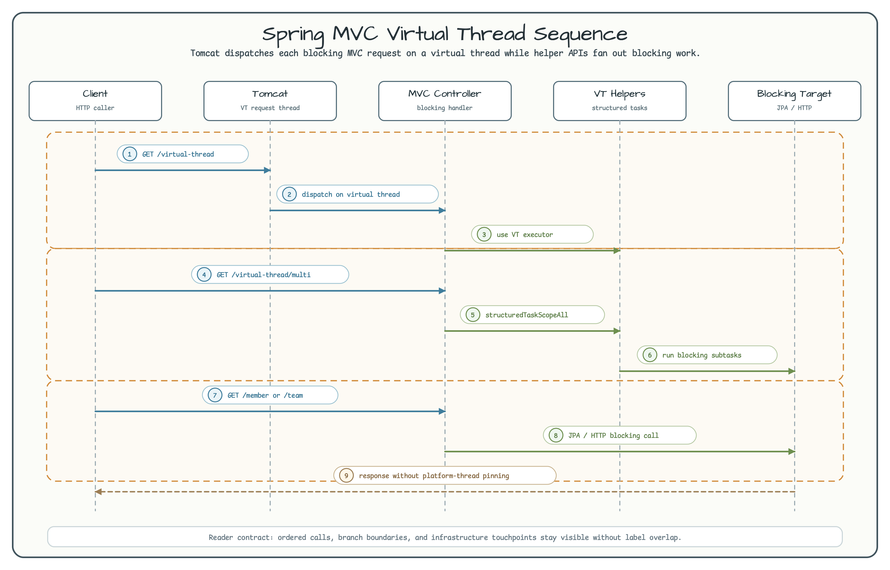

# Spring MVC on Virtual Threads

[English](README.md) | 한국어

이 모듈은 embedded Tomcat 기반의 blocking Spring MVC application을 Java virtual
thread 위에서 실행하는 예제입니다. MVC programming model은 유지하면서 request
handling, `@Async` 작업, 일부 parallel blocking task를 virtual-thread executor로
옮깁니다.

## 아키텍처


## Request Flow



## 무엇을 볼 것인가

| Area | Code | What it demonstrates |
|---|---|---|
| Tomcat request executor | `config/TomcatConfig` | Tomcat protocol handler executor를 `newVirtualThreadPerTaskExecutor()`로 교체합니다 |
| Spring `@Async` | `config/AsyncConfig` | Async method를 virtual-thread executor에서 실행하고 MDC context를 유지합니다 |
| Explicit executor bean | `config/VirtualThreadConfig` | Helper API가 사용할 virtual-thread-per-task executor를 제공합니다 |
| Parallel blocking work | `controller/VirtualThreadController` | `structuredTaskScopeAll`, `virtualFutureAll`로 여러 blocking task를 실행합니다 |
| MVC + JPA endpoints | `controller/MemberController`, `controller/TeamController` | MVC endpoint와 virtual-thread helper에서 repository call을 실행합니다 |
| Blocking HTTP call | `controller/HttpbinController` | Testcontainers 기반 httpbin service를 blocking MVC endpoint에서 호출합니다 |

## Endpoints

| Endpoint | Purpose |
|---|---|
| `GET /virtual-thread` | Virtual-thread setup에서 request가 처리되는지 확인하고 `@Async` 작업을 실행합니다 |
| `GET /virtual-thread/multi` | `structuredTaskScopeAll`로 100개 blocking subtask를 실행합니다 |
| `GET /virtual-thread/virtualFutureAll` | `virtualFutureAll`로 100개 blocking subtask를 실행합니다 |
| `GET /member`, `GET /member/{id}` | MVC controller를 통해 JPA member를 조회합니다 |
| `POST /member/search` | Querydsl 기반 member search를 실행합니다 |
| `GET /team`, `GET /team/{id}`, `GET /team/name/{name}` | MVC controller를 통해 team data를 조회합니다 |
| `GET /httpbin/block/{seconds}` | httpbin test server를 통해 blocking external HTTP call을 실행합니다 |

## 설정

```yaml
spring:
  threads:
    virtual:
      enabled: true

server:
  tomcat:
    threads:
      max: 800
      min-spare: 20
```

핵심 sample code는 `TomcatConfig`입니다. Embedded Tomcat protocol handler를
customize해서 request가 virtual thread에서 실행될 수 있게 합니다. Application은
기본적으로 in-memory H2 database를 사용하며 startup 시 sample `Team`, `Member`
row를 초기화합니다.

## 실행

```bash
./gradlew :virtualthreads-spring-mvc-tomcat:bootRun
```

Application을 띄운 뒤 JPA load scenario를 실행합니다.

```bash
./gradlew :virtualthreads-spring-mvc-tomcat:gatlingRun --simulation simulations.JpaSimulation
```

Gatling report는 `virtualthreads/spring-mvc-tomcat/build/reports/gatling/` 아래에
생성됩니다.

## 테스트

```bash
./gradlew :virtualthreads-spring-mvc-tomcat:test
```
