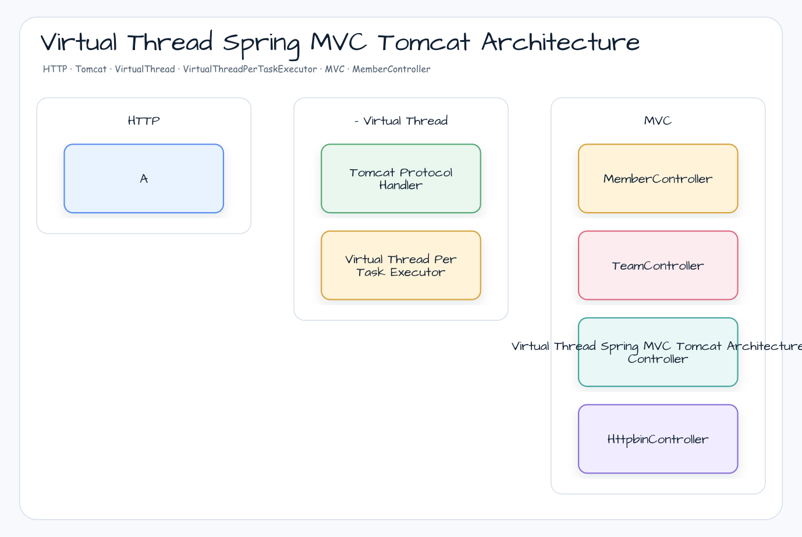
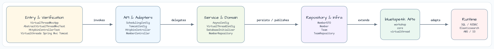
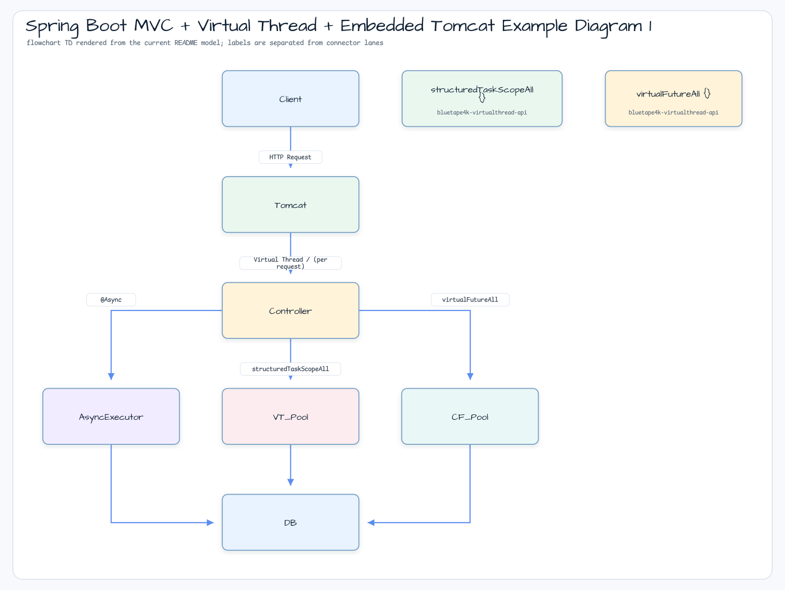
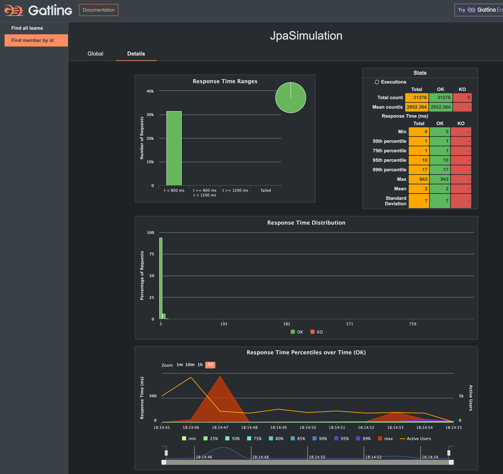
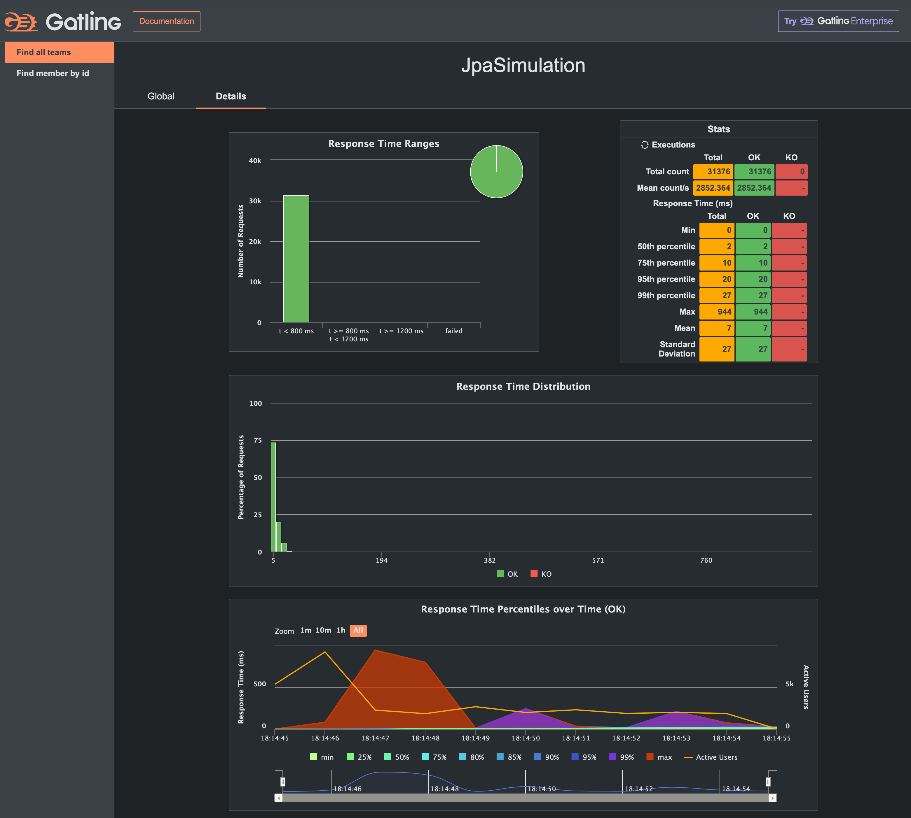

# Spring Boot MVC + Virtual Thread + Embedded Tomcat Example

[English](README.md) | 한국어

## 예제 시나리오

이 예제는 **Spring Boot MVC + Virtual Thread + Embedded Tomcat Example**을 실행 가능한 virtual-thread execution 워크샵 조각으로 다룹니다. 개발자가 먼저 확인할 경로인 모듈 설정, 샘플 또는 테스트 실행, 반복적인 인프라 코드를 줄이는 라이브러리 또는 프레임워크 API 관찰에 초점을 맞춥니다.

## 아키텍처 다이어그램



이 모듈은 샘플 진입점 또는 테스트 픽스처, bluetape4k 확장 계층, 예제에서 사용하는 런타임 의존성을 중심으로 구성됩니다. README와 코드를 비교할 때는 `io.bluetape4k.workshop.virtualthreads` 패키지를 기준으로 삼습니다.



## 흐름 다이어그램

1. `virtualthreads-spring-mvc-tomcat`에 필요한 로컬 런타임을 준비합니다.
2. 예제 시나리오를 담당하는 애플리케이션, 컨트롤러, 서비스 또는 테스트 픽스처를 실행합니다.
3. 반복적인 인프라 작업을 bluetape4k 유틸리티 또는 Spring/Kotlin 통합에 위임합니다.
4. 샘플 출력, HTTP 응답, 저장소 상태, metric, trace 또는 테스트 기대값으로 보이는 결과를 검증합니다.

## 시퀀스 다이어그램

핵심 시퀀스는 호출자 또는 테스트 픽스처 -> 워크샵 어댑터 -> bluetape4k 헬퍼/API -> 외부 런타임 또는 인메모리 백엔드 -> 검증/응답 순서입니다. 전용 시퀀스 자산이 있는 모듈은 아래 이미지가 상호작용 순서를 보여주며, 그렇지 않은 경우 소스 테스트가 실행 가능한 시퀀스의 기준입니다.

이 예제는 Spring Boot MVC에서 Virtual Thread를 사용합니다.

## Virtual Thread 처리 모델




## 환경 설정

[Applying Virtual Threads in Kotlin + Spring Boot](https://jsonobject.tistory.com/631)를 참고해 JDK 25를 설치하세요. 이 예제는 JDK 25를 사용합니다.

### Spring Boot 설정

```yaml
spring:
    threads:
        virtual:
            enabled: true   # Enable Virtual Thread support
```

### Tomcat Virtual Thread Executor

```kotlin
/**
 * Configure Tomcat ProtocolHandler to use a Virtual Thread executor
 */
@Configuration
class TomcatConfig {

    @Bean
    fun protocolHandlerVirtualThreadExecutorCustomizer(): TomcatProtocolHandlerCustomizer<*> {
        return TomcatProtocolHandlerCustomizer<ProtocolHandler> { protocolHandler ->
            protocolHandler.executor = Executors.newVirtualThreadPerTaskExecutor()
        }
    }
}
```

### Virtual Threads를 사용하는 `@Async`

```kotlin
@Configuration(proxyBeanMethods = false)
@EnableAsync
class AsyncConfig {

    @Bean(TaskExecutionAutoConfiguration.APPLICATION_TASK_EXECUTOR_BEAN_NAME)
    fun asyncTaskExecutor(): AsyncTaskExecutor {
        val factory = Thread.ofVirtual().name("async-vt-exec-", 0).factory()
        return TaskExecutorAdapter(Executors.newThreadPerTaskExecutor(factory)).apply {
            setTaskDecorator(LoggingTaskDecorator())
        }
    }
}
```

### Virtual Thread Dispatcher를 사용하는 Kotlin Coroutines

```kotlin
val Dispatchers.VirtualThread: CoroutineDispatcher
    get() = Executors.newVirtualThreadPerTaskExecutor().asCoroutineDispatcher()
```

## 사용한 bluetape4k 기능

| 기능 | Artifact | 코드 위치 | 이점 |
|---|---|---|---|
| `structuredTaskScopeAll` | `bluetape4k-virtualthread-api` | `VirtualThreadController.multipleTasks()` | `StructuredTaskScope.ShutdownOnFailure` boilerplate를 제거하고 exception을 자동으로 aggregate합니다 |
| `virtualFutureAll` | `bluetape4k-virtualthread-api` | `VirtualThreadController.multipleTasksWithVirtualFuture()` | `CompletableFuture.allOf` 대비 한 줄로 parallel Virtual Thread execution을 수행합니다 |
| `KLoggingChannel` | `bluetape4k-logging` | `VirtualThreadController`, `AsyncConfig` | Coroutine context-aware logger companion object입니다 |
| `KLogging` | `bluetape4k-logging` | `AsyncConfig` | SLF4J companion object logger입니다 |
| Hibernate extensions | `bluetape4k-hibernate` | JPA Entity/Repository | Spring Boot 4 + Hibernate 6/7 auto-configuration입니다 |
| Cache support | `bluetape4k-cache-core` | Cache configuration | Caffeine + JCache integration입니다 |
| Testcontainers wrapper | `bluetape4k-testcontainers` | `AbstractVirtualThreadMvcTest` | MySQL container singleton으로, 자동 시작과 재사용을 제공합니다 |

## Before / After

### Parallel Virtual Thread Task Execution

```kotlin
// Before — JDK StructuredTaskScope direct usage (verbose)
fun multipleTasks(): String {
    val taskSize = 100
    val factory = Thread.ofVirtual().name("vt-multi-", 0).factory()

    StructuredTaskScope.ShutdownOnFailure().use { scope ->
        repeat(taskSize) {
            scope.fork {
                Thread.sleep(Random.nextLong(500, 1000))
            }
        }
        scope.join().throwIfFailed()
    }
    return "Done $taskSize tasks"
}

// After — bluetape4k structuredTaskScopeAll
import io.bluetape4k.concurrent.virtualthread.structuredTaskScopeAll

fun multipleTasks(): String {
    val taskSize = 100
    structuredTaskScopeAll("multi", factory) { scope ->
        repeat(taskSize) {
            scope.fork {
                Thread.sleep(Random.nextLong(500, 1000))
                log.debug { "Task $it done. (${Thread.currentThread()})" }
            }
        }
        scope.join().throwIfFailed()
        Unit
    }
    return "Run multiple[$taskSize] tasks. (${Thread.currentThread()})"
}
```

### CompletableFuture 기반 Parallel Virtual Thread Execution

```kotlin
// Before — manual CompletableFuture.allOf + VirtualThread executor management
fun multipleTasksWithFuture(): String {
    val executor = Executors.newVirtualThreadPerTaskExecutor()
    val futures = List(100) { i ->
        CompletableFuture.runAsync({
            Thread.sleep(1000)
        }, executor)
    }
    CompletableFuture.allOf(*futures.toTypedArray()).get()
    executor.shutdown()
    return "Done"
}

// After — bluetape4k virtualFutureAll
import io.bluetape4k.concurrent.virtualthread.virtualFutureAll

fun multipleTasksWithVirtualFuture(): String {
    val tasks = List(100) {
        { Thread.sleep(1000) }
    }
    virtualFutureAll(tasks, executor).await()
    return "Run multiple[100] tasks. (${Thread.currentThread()})"
}
```

## Virtual Thread vs Platform Thread 성능 비교

다음 표는 두 server configuration이 동일한 Gatling load(10->400 concurrent users, 30s ramp)를 처리할 때 관찰되는 동작을 요약합니다.

| Metric | Platform Thread (default Tomcat) | Virtual Thread |
|---|---|---|
| **Thread pool limit** | ~200 threads(Tomcat default) | Unbounded(one VT per request) |
| **Blocking I/O behavior** | OS thread blocked(pool pressure) | Carrier thread released(no blocking) |
| **Memory per thread** | ~1 MB stack | ~few KB heap per VT |
| **Context switch cost** | OS kernel context switch | JVM scheduler — cheaper |
| **Throughput (blocking endpoints)** | > 200 concurrent에서 저하 | 선형적으로 확장 |
| **p99 response time (400 users)** | 부하에서 급증 | 안정적으로 유지 |
| **Suitable for** | CPU-bound workloads | I/O-bound workloads(DB, HTTP, file) |

> Note: Virtual Threads do **not** improve CPU-bound workloads. Benefits appear only when threads
> spend significant time blocked on I/O (DB queries, external HTTP calls, file reads).

### Virtual Threads가 빛나는 경우

```
Scenario: 400 concurrent DB queries (each blocks 50ms)

Platform threads:
    200-thread pool → 200 queries in parallel → 200 queries wait in queue
    → average response time ≈ 100ms (50ms active + 50ms queue wait)

Virtual threads:
    400 VTs scheduled on ~8 carrier threads → all 400 in progress concurrently
    → average response time ≈ 50ms (no queue wait)
```

## Gatling으로 Load Testing

### Step 1 — Application 시작

```bash
./gradlew :virtualthreads-spring-mvc-tomcat:bootRun
```

### Step 2 — Simulation 실행

```bash
# All simulations
./gradlew :virtualthreads-spring-mvc-tomcat:gatlingRun

# Specific simulation
./gradlew :virtualthreads-spring-mvc-tomcat:gatlingRun --simulation simulations.VirtualThreadSimulation
./gradlew :virtualthreads-spring-mvc-tomcat:gatlingRun --simulation simulations.JpaSimulation
```

### Step 3 — Report 확인

Report는 `build/reports/gatling/<simulation-name>-<timestamp>/index.html`에 생성됩니다.

### Stop Conditions

Assertion gate를 추가하려면 다음과 같이 설정합니다.

```kotlin
init {
    setUp(
        scn.injectClosed(rampConcurrentUsers(10).to(400).during(30.seconds.toJavaDuration()))
    ).protocols(httpProtocol)
     .assertions(
         global().responseTime().percentile(95.0).lt(500),   // p95 < 500ms
         global().successfulRequests().percent().gt(99.0)     // error rate < 1%
     )
}
```

## 성능 측정

### Find Member by Id API

이 API는 `/api/members/{id}`를 호출해 `Member` 정보를 조회합니다.



### JPA Find All Teams API

이 API는 `/api/teams`를 호출해 `Team` 정보를 조회합니다.



## 사전 요구 사항

- Docker(Testcontainers MySQL용)
- JDK 25
- 사용 가능한 8080 port

## 참고 자료

### Spring Boot with Virtual Threads

- [Applying Virtual Threads in Kotlin + Spring Boot](https://jsonobject.tistory.com/631)
- [A guide to using virtual threads with Spring Boot](https://bell-sw.com/blog/a-guide-to-using-virtual-threads-with-spring-boot/)
- [Virtual Threads in Springboot 3.2](https://medium.com/nerd-for-tech/virtual-threads-in-springboot-3-2-9a7250429809?)

### Gatling

- [gatling/gatling-gradle-plugin-demo-kotlin](https://github.com/gatling/gatling-gradle-plugin-demo-kotlin)
- [Stress Testing with Gatling & Kotlin - Part 2](https://medium.com/@mdportnov/stress-testing-with-gatling-kotlin-part-2-1eb13d489dc9)
- [boot-vt-benchmark](https://github.com/olegonsoftware/boot-vt-benchmark)
- [Gatling Gradle Plugin](https://docs.gatling.io/reference/extensions/build-tools/gradle-plugin/)
- [Kotlin Gatling Tutorial](https://github.com/mdportnov/kotlin-gatling-tutorial)
