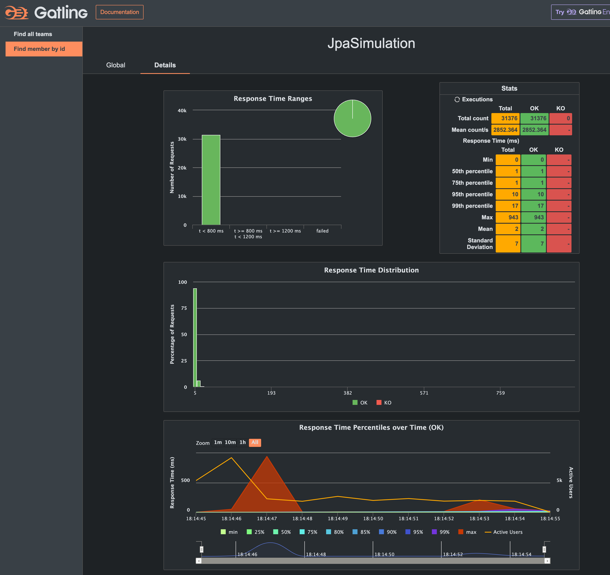
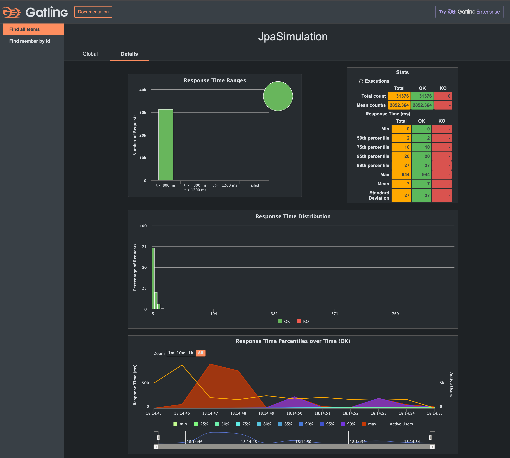

# Spring Boot MVC + Virtual Thread + Embedded Tomcat 예제

Spring Boot MVC 에서 Virtual Thread 를 사용하는 예제입니다.

## 환경 설정

[Kotlin + Spring Boot, Virtual Thread 적용하기](https://jsonobject.tistory.com/631) 를 참고하여 기본적인 JDK 21을 설치한다.
현 예제는 zulu-jdk.21 을 사용하였습니다.

### Spring Boot 설정

Application 환경 설정

다음과 같이 Spring Boot 환경설정에서 `application.yml` 에 다음과 같이 `spring.threads.virtual.enabled=true` 를 추가한다.

```yaml
spring:
    threads:
        virtual:
            enabled: true   # Virtual Thread 사용 여부
```

Spring MVC 에서 Virtual Thread 를 사용할 때, Tomcat 을 사용하고 있다면, Tomcat 의 설정을 변경해야 한다.

```kotlin
/**
 * Tomcat ProtocolHandler의 executor를 Virtual Thread를 사용하는 Executor를 사용하도록 설정
 */
@Configuration
class TomcatConfig {

    /**
     * Tomcat ProtocolHandler의 executor 를 Virtual Thread 를 사용하는 Executor를 사용하도록 설정
     */
    @Bean
    fun protocolHandlerVirtualThreadExecutorCustomizer(): TomcatProtocolHandlerCustomizer<*> {
        return TomcatProtocolHandlerCustomizer<ProtocolHandler> { protocolHandler ->
            protocolHandler.executor = Executors.newVirtualThreadPerTaskExecutor()
        }
    }
}
```

Spring Configuration에 `@Async` 작업을 할 때, Virtual Thread 를 사용할 수 있도록 설정합니다. (참고: config/AsyncConfig.kt)

```kotlin
@Configuration
@EnableAsync
class AsyncConfig {

    @Bean
    fun asyncTaskExecutor(): AsyncTaskExecutor {
        return TaskExecutorAdapter(Executors.newVirtualThreadPerTaskExecutor())
            .apply {
                setTaskDecorator(LoggingTaskDecorator())
            }
    }
}
```

#### Kotlin Coroutines

Kotlin Coroutines 를 사용할 때, Virtual Thread 를 사용하고자 할 때에는 Virtual Thread를 CoroutineContext 로 사용할 수 있도록 설정합니다. (참고:
coroutines/CoroutinesSupport.kt)

```kotlin
val Dispatchers.VirtualThread: CoroutineDispatcher
    get() = Executors.newVirtualThreadPerTaskExecutor().asCoroutineDispatcher()
```

## 성능 측정

### Find Member by Id API

`/api/members/{id}` API 를 호출하여 Member 정보를 조회하는 API 입니다.



### JPA Find All Teams API

`/api/teams` API 를 호출하여 Team 정보를 조회하는 API 입니다.



## 참고 자료

### Spring Boot with Virtual Threads

- [Kotlin + Spring Boot, Virtual Thread 적용하기](https://jsonobject.tistory.com/631)
- [A guide to using virtual threads with Spring Boot](https://bell-sw.com/blog/a-guide-to-using-virtual-threads-with-spring-boot/)
- [Virtual Threads in Springboot 3.2](https://medium.com/nerd-for-tech/virtual-threads-in-springboot-3-2-9a7250429809?)
-

### Gatling

- [gatling/gatling-gradle-plugin-demo-kotlin](https://github.com/gatling/gatling-gradle-plugin-demo-kotlin)
- [Stress Testing with Gatling & Kotlin - Part 2](https://medium.com/@mdportnov/stress-testing-with-gatling-kotlin-part-2-1eb13d489dc9)
- [boot-vt-benchmark](https://github.com/olegonsoftware/boot-vt-benchmark)
- [Gatling Gradle Plugin](https://docs.gatling.io/reference/extensions/build-tools/gradle-plugin/)
- [Kotlin Gatling Tutorial](https://github.com/mdportnov/kotlin-gatling-tutorial)
