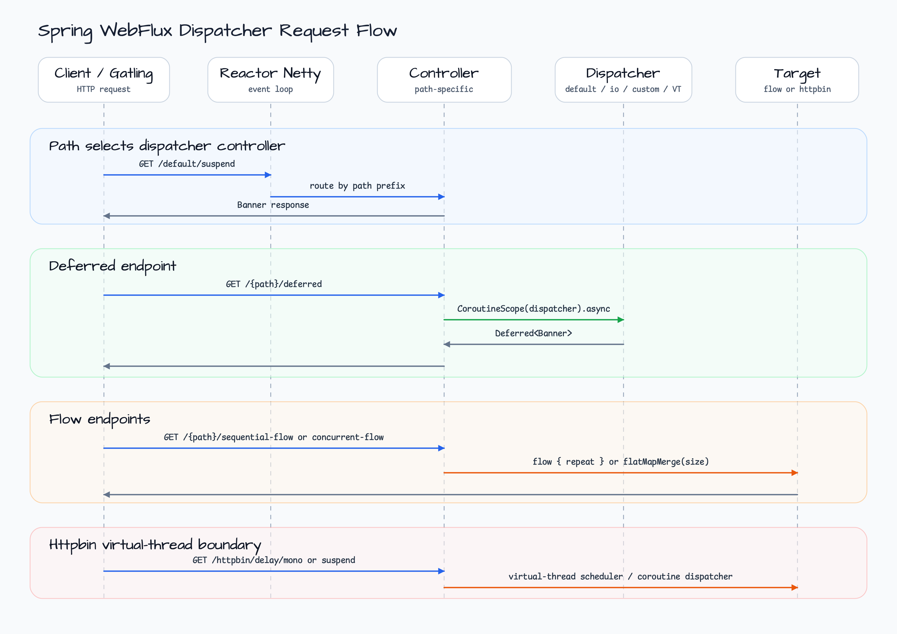

# Spring WebFlux Dispatcher Comparison

[English](README.md) | 한국어

이 모듈은 Spring WebFlux application에서 네 가지 coroutine dispatcher 선택지를
비교합니다: `Dispatchers.Default`, `Dispatchers.IO`, custom fixed pool,
virtual-thread-per-task dispatcher. 각 controller가 같은 endpoint set을 제공하므로
test와 Gatling scenario에서 path만 바꿔 동작을 비교할 수 있습니다.

## 아키텍처


## Request Flow



## Dispatcher Paths

| Path | Controller | Dispatcher |
|---|---|---|
| `/default/*` | `DefaultDispatcherController` | `Dispatchers.Default` |
| `/io/*` | `IODispatcherController` | `Dispatchers.IO` |
| `/custom/*` | `CustomDispatcherController` | `newFixedThreadPoolContext(2 * availableProcessors, "custom")` |
| `/virtual-thread/*` | `VirtualThreadDispatcherController` | `Executors.newVirtualThreadPerTaskExecutor().asCoroutineDispatcher()` |

## Shared Endpoints

모든 dispatcher controller는 `AbstractDispatcherController`에서 같은 endpoint set을
상속합니다.

| Endpoint | What it exercises |
|---|---|
| `GET /{path}` | 짧은 delay가 있는 simple suspend endpoint |
| `GET /{path}/suspend` | WebFlux coroutine path에서 suspend function 실행 |
| `GET /{path}/deferred` | `CoroutineScope(dispatcher).async { ... }` |
| `GET /{path}/sequential-flow?size=4` | Sequential `Flow` emission |
| `GET /{path}/concurrent-flow?size=4` | `flatMapMerge(size)` concurrent `Flow` emission |
| `POST /{path}/request-as-flow` | Request body를 `Flow<JsonNode>`로 처리 |
| `GET /httpbin/delay/mono/{seconds}` | Virtual-thread Reactor scheduler에서 subscribe하는 WebClient call |
| `GET /httpbin/delay/suspend/{seconds}` | Virtual-thread coroutine dispatcher 안에서 await하는 WebClient call |

## Runtime Configuration

`NettyConfig`는 sample의 Reactor Netty resource를 조정합니다.

| Setting | Purpose |
|---|---|
| `ConnectionProvider.maxConnections(10_000)` | Gatling run 중 높은 concurrency를 허용합니다 |
| `LoopResources.create("event-loop", 4, maxOf(availableProcessors * 8, 64), true)` | WebFlux용 bounded event-loop group을 사용합니다 |
| Read/write timeout handlers | Load test 중 멈춘 connection을 방지합니다 |

`AsyncConfig`는 inheritable thread-local propagation이 켜진 virtual-thread-backed
Spring `AsyncTaskExecutor`도 제공합니다.

## 실행

```bash
./gradlew :virtualthreads-spring-webflux:bootRun
```

모든 dispatcher simulation을 실행합니다.

```bash
./gradlew :virtualthreads-spring-webflux:gatlingRun
```

Virtual-thread simulation만 실행합니다.

```bash
./gradlew :virtualthreads-spring-webflux:gatlingRun \
  --simulation simulations.VirtualThreadCoroutineSimulation
```

Gatling report는 `virtualthreads/spring-webflux/build/reports/gatling/` 아래에
생성됩니다.

## 테스트

```bash
./gradlew :virtualthreads-spring-webflux:test
```
