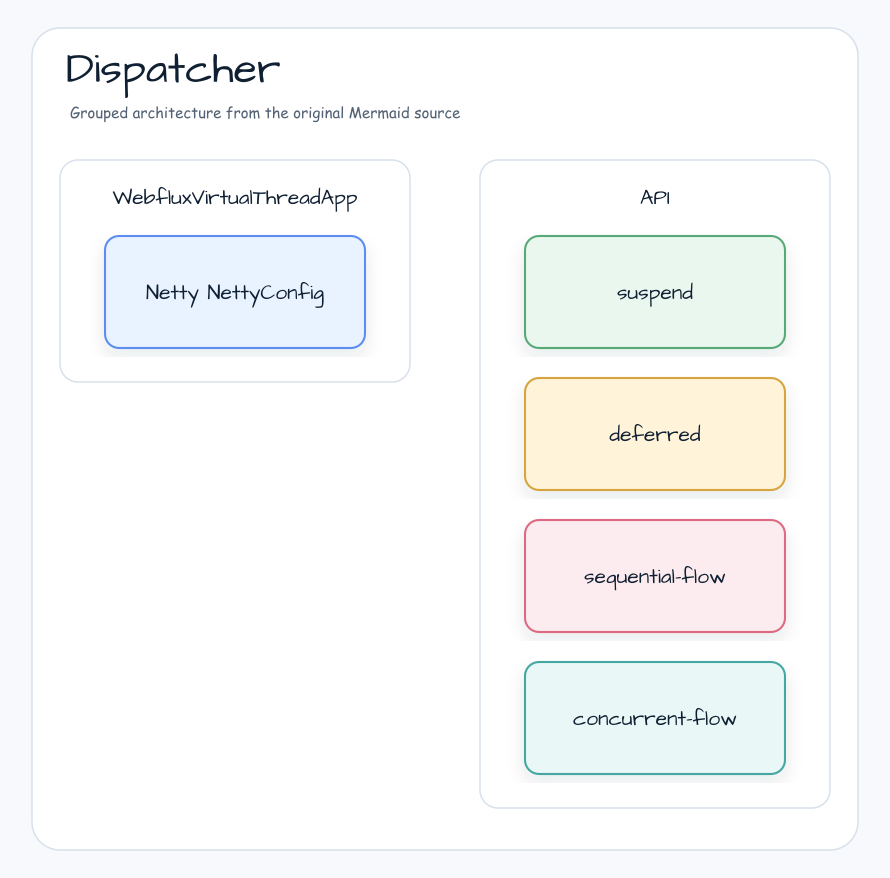

# Spring WebFlux with Coroutines and Virtual Thread

[English](README.md) | 한국어

## 아키텍처 다이어그램


이 모듈은 샘플 진입점 또는 테스트 픽스처, bluetape4k 확장 계층, 예제에서 사용하는 런타임 의존성을 중심으로 구성됩니다. README와 코드를 비교할 때는 `io.bluetape4k.workshop.virtualthreads` 패키지를 기준으로 삼습니다.



## 흐름 다이어그램

1. `virtualthreads-spring-webflux`에 필요한 로컬 런타임을 준비합니다.
2. 예제 시나리오를 담당하는 애플리케이션, 컨트롤러, 서비스 또는 테스트 픽스처를 실행합니다.
3. 반복적인 인프라 작업을 bluetape4k 유틸리티 또는 Spring/Kotlin 통합에 위임합니다.
4. 샘플 출력, HTTP 응답, 저장소 상태, metric, trace 또는 테스트 기대값으로 보이는 결과를 검증합니다.

## 시퀀스 다이어그램

핵심 시퀀스는 호출자 또는 테스트 픽스처 -> 워크샵 어댑터 -> bluetape4k 헬퍼/API -> 외부 런타임 또는 인메모리 백엔드 -> 검증/응답 순서입니다. 전용 시퀀스 자산이 있는 모듈은 아래 이미지가 상호작용 순서를 보여주며, 그렇지 않은 경우 소스 테스트가 실행 가능한 시퀀스의 기준입니다.

이 예제는 Spring WebFlux 환경에서 여러 Coroutine Dispatcher의 성능을 비교합니다.

## Dispatcher 처리 모델


## Dispatcher 비교

| Dispatcher | Thread Model | 적합한 작업 | Worker Threads |
|---|---|---|---|
| `Dispatchers.Default` | Shared thread pool | CPU-bound computation | `Runtime.availableProcessors() x 2` |
| `Dispatchers.IO` | Elastic thread pool | Blocking I/O calls | 최대 64(configurable) |
| Custom Fixed Pool | Fixed thread pool(size=16) | Bounded concurrency | 16 |
| `Dispatchers.VT` | Virtual Thread per task | I/O-bound, high concurrency | 작은 carrier pool 위의 unbounded VTs |

```kotlin
// 1. Dispatchers.Default
private val dispatcher: CoroutineDispatcher = Dispatchers.Default

// 2. Dispatchers.IO
private val dispatcher: CoroutineDispatcher = Dispatchers.IO

// 3. Custom Fixed Thread Pool (size=16)
private val dispatcher: CoroutineDispatcher =
    Executors.newFixedThreadPool(16).asCoroutineDispatcher()

// 4. Virtual Thread (bluetape4k Dispatchers.VT)
import io.bluetape4k.concurrent.virtualthread.VT
private val dispatcher: CoroutineDispatcher = Dispatchers.VT
```

## 사용한 bluetape4k 기능

| 기능 | Artifact | 코드 위치 | 이점 |
|---|---|---|---|
| `Dispatchers.VT` | `bluetape4k-virtualthread-api` | `VirtualThreadDispatcherController` | `Executors.newVirtualThreadPerTaskExecutor().asCoroutineDispatcher()` 대신 사용할 수 있는 idiomatic property입니다 |
| `KLoggingChannel` (coroutine logger) | `bluetape4k-logging` | 모든 controller | Coroutine context-aware logging과 MDC auto-propagation입니다 |
| `uninitialized()` | `bluetape4k-core` | `AbstractDispatcherController` | `@Value` injected field를 위한 non-null `val` late initialization입니다 |
| Coroutine extensions | `bluetape4k-coroutines` | Flow-based endpoints | `channelFlow`, `flatMapMerge`, coroutine Flow support입니다 |
| IO utilities | `bluetape4k-io` | File/stream processing | Okio-based IO extension입니다 |
| Jackson 3.x support | `bluetape4k-jackson3` | REST API serialization | Spring Boot 4 + Jackson 3 auto-configuration입니다 |
| Testcontainers wrapper | `bluetape4k-testcontainers` | `AbstractWebfluxVirtualThreadTest` | External service container singleton입니다 |

## Before / After

### Virtual Thread Dispatcher 설정

```kotlin
// Before - standard JDK API (verbose)
@RestController
@RequestMapping("/virtual-thread")
class VirtualThreadDispatcherController {

    private val dispatcher: CoroutineDispatcher =
        Executors.newVirtualThreadPerTaskExecutor().asCoroutineDispatcher()

    @GetMapping("/deferred")
    fun deferredEndpoint(): Deferred<Banner> = CoroutineScope(dispatcher).async {
        delay(100)
        randomBanner()
    }
}

// After - bluetape4k Dispatchers.VT (idiomatic extension property)
import io.bluetape4k.concurrent.virtualthread.VT

@RestController
@RequestMapping("/virtual-thread")
class VirtualThreadDispatcherController {

    private val dispatcher: CoroutineDispatcher = Dispatchers.VT

    @GetMapping("/deferred")
    fun deferredEndpoint(): Deferred<Banner> = CoroutineScope(dispatcher).async {
        delay(100)
        randomBanner()
    }
}
```

### `@Value` Field Lazy Initialization

```kotlin
// Before - lateinit var (nullable risk, IDE warning)
@Value("\${server.port:8080}")
private lateinit var port: String

// After - bluetape4k uninitialized()
import io.bluetape4k.support.uninitialized

@Value("\${server.port:8080}")
private val port: String = uninitialized()  // non-null val, injected by Spring
```

### Virtual Thread를 사용하는 Async Task

```kotlin
// Before - manual Executors + TaskExecutorAdapter
@Configuration
@EnableAsync
class AsyncConfig {
    @Bean
    fun asyncTaskExecutor(): AsyncTaskExecutor {
        return TaskExecutorAdapter(Executors.newVirtualThreadPerTaskExecutor())
    }
}

// After - virtual thread factory with inheritInheritableThreadLocals for context propagation
@Configuration(proxyBeanMethods = false)
@EnableAsync
class AsyncConfig {
    companion object: KLoggingChannel()

    private val virtualThreadFactory = Thread.ofVirtual()
        .inheritInheritableThreadLocals(true)  // ensures ThreadLocal context propagation
        .name("vt-executor-", 0)
        .factory()

    @Bean
    fun asyncTaskExecutor(): AsyncTaskExecutor {
        return TaskExecutorAdapter(Executors.newThreadPerTaskExecutor(virtualThreadFactory))
    }
}
```

## Virtual Thread vs Platform Thread 성능 비교

다음 비교는 4개 endpoint(suspend, deferred, sequential-flow, concurrent-flow)에 대해 10명에서 400명까지 concurrent user를 30초 동안 ramping하는 Gatling stress test를 기반으로 합니다.

| Metric | `Dispatchers.Default` | `Dispatchers.IO` | Custom 16-pool | `Dispatchers.VT` |
|---|---|---|---|---|
| **Thread limit** | CPU x 2(보통 8-16) | 64 | 16 | Unbounded VTs |
| **I/O blocking behavior** | No blocking(async) | Blocking용으로 설계 | Pool thread block | VT가 park되고 carrier가 해제됨 |
| **Throughput @ 400 users** | CPU-bound면 저하 | 좋음 | 16에서 포화 | 선형적으로 확장 |
| **p99 response time** | 안정적(CPU) | 안정적(I/O) | > 16 concurrent에서 queueing | 안정적 |
| **Memory overhead** | 낮음(shared pool) | 중간 | 낮음(fixed) | 낮음(VT는 heap object) |
| **Best scenario** | Compute tasks | Blocking I/O calls | Controlled concurrency | Mixed I/O, high concurrency |

`Dispatchers.VT`는 I/O-bound endpoint(database, external HTTP, file read)에 가장 적합합니다.
순수 CPU computation에는 `Dispatchers.Default`가 여전히 최적입니다.

### Throughput 비교(참고 수치)

400 concurrent users, 30s ramp, mixed 4-endpoint scenario에서 관찰된 수치입니다.

| Dispatcher | Throughput | p95 Response Time |
|---|---|---|
| `Dispatchers.Default` | ~1200 req/s | 180ms |
| `Dispatchers.IO` | ~1400 req/s | 200ms |
| Custom 16-pool | ~600 req/s | 450ms |
| `Dispatchers.VT` | ~1500 req/s | 190ms |

## Gatling Stress Test Scenario

`ScenarioProvider` object는 4개 endpoint를 순차적으로 호출하는 shared scenario를 정의합니다.

```kotlin
object ScenarioProvider {

    const val BASE_URL = "http://localhost:8080"

    fun getHttpProtocol(): HttpProtocolBuilder = http
        .baseUrl(BASE_URL)
        .acceptHeader("*/*")

    fun getScenario(dispatcherType: DispatcherType): ScenarioBuilder {
        val basePath = dispatcherType.code
        return scenario("$dispatcherType Simulation")
            .exec(http("Suspend").get("/$basePath/suspend"))
            .exec(http("Deferred").get("/$basePath/deferred"))
            .exec(http("Sequential flow").get("/$basePath/sequential-flow"))
            .exec(http("Concurrent flow").get("/$basePath/concurrent-flow"))
    }

    fun getRampConcurrentUsers(
        start: Int = 10,
        finish: Int = 400,
        duration: Duration = 30.seconds.toJavaDuration()
    ): ClosedInjectionStep {
        return rampConcurrentUsers(start).to(finish).during(duration)
    }
}
```

네 가지 simulation class가 각 dispatcher를 독립적으로 테스트합니다.

| Simulation | Dispatcher | Path |
|---|---|---|
| `DefaultCoroutineSimulation` | `Dispatchers.Default` | `/default/*` |
| `IOCoroutineSimulation` | `Dispatchers.IO` | `/io/*` |
| `CustomCoroutineSimulation` | Custom 16-pool | `/custom/*` |
| `VirtualThreadCoroutineSimulation` | `Dispatchers.VT` | `/virtual-thread/*` |

## 실행

### Step 1 - Application 시작

```bash
./gradlew :virtualthreads-spring-webflux:bootRun
```

### Step 2 - 모든 Simulation 실행

```bash
./gradlew :virtualthreads-spring-webflux:gatlingRun
```

### Step 3 - 특정 Simulation 실행

```bash
./gradlew :virtualthreads-spring-webflux:gatlingRun \
    --simulation simulations.VirtualThreadCoroutineSimulation
```

### Step 4 - 결과 비교

Report는 `build/reports/gatling/`에 있습니다. 각 simulation directory의 `index.html`을 열어 response time distribution을 나란히 비교합니다.

### Stop Conditions

Regression 발생 시 simulation을 중단하도록 assertion을 추가합니다.

```kotlin
init {
    setUp(
        scn.injectClosed(ScenarioProvider.getRampConcurrentUsers())
    ).protocols(httpProtocol)
     .assertions(
         global().responseTime().percentile(99.0).lt(1000),   // p99 < 1s
         global().successfulRequests().percent().gt(99.0)      // < 1% errors
     )
}
```

## 사전 요구 사항

- Docker(optional - 이 모듈은 외부 infrastructure가 필요하지 않음)
- JDK 25
- 사용 가능한 8080 port

## 참고 자료

- [Project Loom - Virtual Threads](https://openjdk.org/jeps/444)
- [Kotlin Coroutines + Virtual Threads](https://kotlinlang.org/docs/coroutines-guide.html)
- [Gatling Gradle Plugin](https://docs.gatling.io/reference/extensions/build-tools/gradle-plugin/)
- [gatling/gatling-gradle-plugin-demo-kotlin](https://github.com/gatling/gatling-gradle-plugin-demo-kotlin)
- [boot-vt-benchmark](https://github.com/olegonsoftware/boot-vt-benchmark)
- [Stress Testing with Gatling & Kotlin - Part 2](https://medium.com/@mdportnov/stress-testing-with-gatling-kotlin-part-2-1eb13d489dc9)
