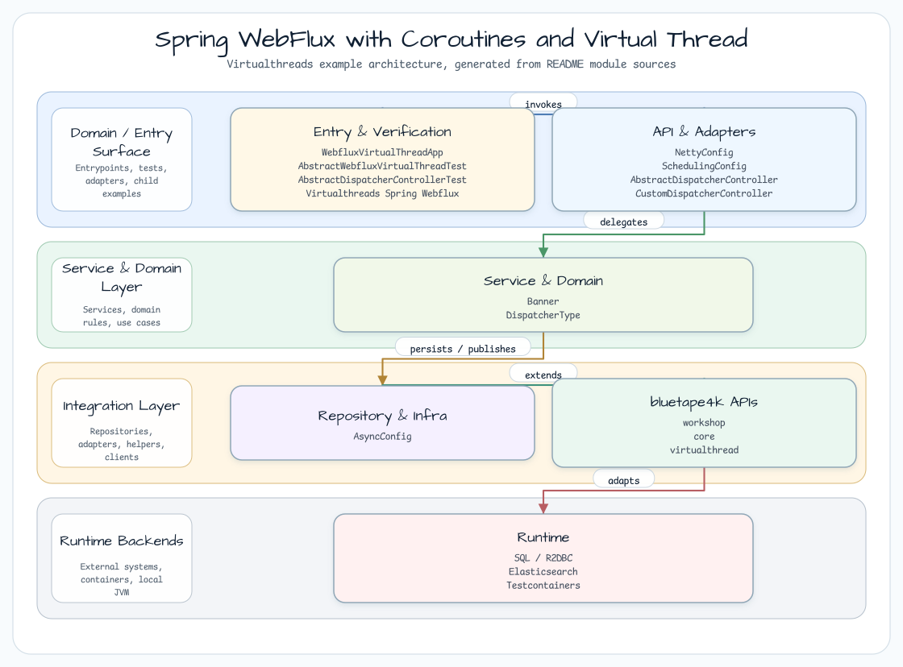

# Spring WebFlux with Coroutines and Virtual Thread

[한국어](README.ko.md) | English

## Example Scenario

This example exercises **Spring WebFlux with Coroutines and Virtual Thread** as a runnable virtual-thread execution workshop slice. It focuses on the path a developer would inspect first: configure the module, run the sample or tests, and observe the library or framework APIs that remove repetitive infrastructure code.

## Architecture Diagram



The module is organized around the sample entry point or test fixture, the bluetape4k extension layer, and the runtime dependency used by the example. Keep the package under `io.bluetape4k.workshop.virtualthreads` as the source of truth when comparing this README with the code.

## Sequence Diagram

This example compares the performance of several Coroutine Dispatchers in a Spring WebFlux environment.

## Dispatcher Processing Model

## Dispatcher Comparison

| Dispatcher | Thread Model | Best For | Worker Threads |
|---|---|---|---|
| `Dispatchers.Default` | Shared thread pool | CPU-bound computation | `Runtime.availableProcessors() x 2` |
| `Dispatchers.IO` | Elastic thread pool | Blocking I/O calls | Up to 64 (configurable) |
| Custom Fixed Pool | Fixed thread pool (size=16) | Bounded concurrency | 16 |
| `Dispatchers.VT` | Virtual Thread per task | I/O-bound, high concurrency | Unbounded VTs on small carrier pool |

```kotlin
// 1. Dispatchers.Default
private val dispatcher: CoroutineDispatcher = Dispatchers.Default

// 2. Dispatchers.IO
private val dispatcher: CoroutineDispatcher = Dispatchers.IO

// 3. Custom Fixed Thread Pool (size=16)
private val dispatcher: CoroutineDispatcher =
    Executors.newFixedThreadPool(16).asCoroutineDispatcher()

// 4. Virtual Thread (bluetape4k Dispatchers.VT)
import io.bluetape4k.concurrent.virtualthread.VT
private val dispatcher: CoroutineDispatcher = Dispatchers.VT
```

## Used bluetape4k Features

| Feature | Artifact | Code Location | Benefit |
|---|---|---|---|
| `Dispatchers.VT` | `bluetape4k-virtualthread-api` | `VirtualThreadDispatcherController` | Single idiomatic property vs `Executors.newVirtualThreadPerTaskExecutor().asCoroutineDispatcher()` |
| `KLoggingChannel` (coroutine logger) | `bluetape4k-logging` | All controllers | Coroutine context-aware logging; MDC auto-propagation |
| `uninitialized()` | `bluetape4k-core` | `AbstractDispatcherController` | Non-null `val` late initialization for `@Value`-injected fields |
| Coroutine extensions | `bluetape4k-coroutines` | Flow-based endpoints | `channelFlow`, `flatMapMerge`, coroutine Flow support |
| IO utilities | `bluetape4k-io` | File/stream processing | Okio-based IO extensions |
| Jackson 3.x support | `bluetape4k-jackson3` | REST API serialization | Spring Boot 4 + Jackson 3 auto-configuration |
| Testcontainers wrapper | `bluetape4k-testcontainers` | `AbstractWebfluxVirtualThreadTest` | External service container singleton |

## Before / After

### Virtual Thread Dispatcher Configuration

```kotlin
// Before - standard JDK API (verbose)
@RestController
@RequestMapping("/virtual-thread")
class VirtualThreadDispatcherController {

    private val dispatcher: CoroutineDispatcher =
        Executors.newVirtualThreadPerTaskExecutor().asCoroutineDispatcher()

    @GetMapping("/deferred")
    fun deferredEndpoint(): Deferred<Banner> = CoroutineScope(dispatcher).async {
        delay(100)
        randomBanner()
    }
}

// After - bluetape4k Dispatchers.VT (idiomatic extension property)
import io.bluetape4k.concurrent.virtualthread.VT

@RestController
@RequestMapping("/virtual-thread")
class VirtualThreadDispatcherController {

    private val dispatcher: CoroutineDispatcher = Dispatchers.VT

    @GetMapping("/deferred")
    fun deferredEndpoint(): Deferred<Banner> = CoroutineScope(dispatcher).async {
        delay(100)
        randomBanner()
    }
}
```

### `@Value` Field Lazy Initialization

```kotlin
// Before - lateinit var (nullable risk, IDE warning)
@Value("\${server.port:8080}")
private lateinit var port: String

// After - bluetape4k uninitialized()
import io.bluetape4k.support.uninitialized

@Value("\${server.port:8080}")
private val port: String = uninitialized()  // non-null val, injected by Spring
```

### Async Tasks with Virtual Thread

```kotlin
// Before - manual Executors + TaskExecutorAdapter
@Configuration
@EnableAsync
class AsyncConfig {
    @Bean
    fun asyncTaskExecutor(): AsyncTaskExecutor {
        return TaskExecutorAdapter(Executors.newVirtualThreadPerTaskExecutor())
    }
}

// After - virtual thread factory with inheritInheritableThreadLocals for context propagation
@Configuration(proxyBeanMethods = false)
@EnableAsync
class AsyncConfig {
    companion object: KLoggingChannel()

    private val virtualThreadFactory = Thread.ofVirtual()
        .inheritInheritableThreadLocals(true)  // ensures ThreadLocal context propagation
        .name("vt-executor-", 0)
        .factory()

    @Bean
    fun asyncTaskExecutor(): AsyncTaskExecutor {
        return TaskExecutorAdapter(Executors.newThreadPerTaskExecutor(virtualThreadFactory))
    }
}
```

## Virtual Thread vs Platform Thread Performance Comparison

The following comparison is based on a Gatling stress test ramping from 10 to 400 concurrent users
over 30 seconds, hitting 4 endpoints (suspend, deferred, sequential-flow, concurrent-flow):

| Metric | `Dispatchers.Default` | `Dispatchers.IO` | Custom 16-pool | `Dispatchers.VT` |
|---|---|---|---|---|
| **Thread limit** | CPU x 2 (typically 8-16) | 64 | 16 | Unbounded VTs |
| **I/O blocking behavior** | No blocking (async) | Designed for blocking | Blocks pool threads | VTs park, carrier freed |
| **Throughput @ 400 users** | Degrades if CPU-bound | Good | Saturates at 16 | Scales linearly |
| **p99 response time** | Stable (CPU) | Stable (I/O) | Queues at > 16 concurrent | Stable |
| **Memory overhead** | Low (shared pool) | Medium | Low (fixed) | Low (VTs are heap objects) |
| **Best scenario** | Compute tasks | Blocking I/O calls | Controlled concurrency | Mixed I/O, high concurrency |

`Dispatchers.VT` performs best for I/O-bound endpoints (database, external HTTP, file reads).
For pure CPU computation, `Dispatchers.Default` remains optimal.

### Throughput Comparison (indicative)

Observed under 400 concurrent users, 30s ramp, mixed 4-endpoint scenario:

| Dispatcher | Throughput | p95 Response Time |
|---|---|---|
| `Dispatchers.Default` | ~1200 req/s | 180ms |
| `Dispatchers.IO` | ~1400 req/s | 200ms |
| Custom 16-pool | ~600 req/s | 450ms |
| `Dispatchers.VT` | ~1500 req/s | 190ms |

## Gatling Stress Test Scenarios

The `ScenarioProvider` object defines a shared scenario hitting all 4 endpoints sequentially:

```kotlin
object ScenarioProvider {

    const val BASE_URL = "http://localhost:8080"

    fun getHttpProtocol(): HttpProtocolBuilder = http
        .baseUrl(BASE_URL)
        .acceptHeader("*/*")

    fun getScenario(dispatcherType: DispatcherType): ScenarioBuilder {
        val basePath = dispatcherType.code
        return scenario("$dispatcherType Simulation")
            .exec(http("Suspend").get("/$basePath/suspend"))
            .exec(http("Deferred").get("/$basePath/deferred"))
            .exec(http("Sequential flow").get("/$basePath/sequential-flow"))
            .exec(http("Concurrent flow").get("/$basePath/concurrent-flow"))
    }

    fun getRampConcurrentUsers(
        start: Int = 10,
        finish: Int = 400,
        duration: Duration = 30.seconds.toJavaDuration()
    ): ClosedInjectionStep {
        return rampConcurrentUsers(start).to(finish).during(duration)
    }
}
```

Four simulation classes test each dispatcher independently:

| Simulation | Dispatcher | Path |
|---|---|---|
| `DefaultCoroutineSimulation` | `Dispatchers.Default` | `/default/*` |
| `IOCoroutineSimulation` | `Dispatchers.IO` | `/io/*` |
| `CustomCoroutineSimulation` | Custom 16-pool | `/custom/*` |
| `VirtualThreadCoroutineSimulation` | `Dispatchers.VT` | `/virtual-thread/*` |

## Running

### Step 1 - Start the Application

```bash
./gradlew :virtualthreads-spring-webflux:bootRun
```

### Step 2 - Run All Simulations

```bash
./gradlew :virtualthreads-spring-webflux:gatlingRun
```

### Step 3 - Run a Specific Simulation

```bash
./gradlew :virtualthreads-spring-webflux:gatlingRun \
    --simulation simulations.VirtualThreadCoroutineSimulation
```

### Step 4 - Compare Results

Reports are in `build/reports/gatling/`. Open the `index.html` from each simulation's directory
and compare the response time distributions side by side.

### Stop Conditions

Add assertions to halt the simulation on regression:

```kotlin
init {
    setUp(
        scn.injectClosed(ScenarioProvider.getRampConcurrentUsers())
    ).protocols(httpProtocol)
     .assertions(
         global().responseTime().percentile(99.0).lt(1000),   // p99 < 1s
         global().successfulRequests().percent().gt(99.0)      // < 1% errors
     )
}
```

## Prerequisites

- Docker (optional - no external infrastructure required for this module)
- JDK 25
- Port 8080 available

## References

- [Project Loom - Virtual Threads](https://openjdk.org/jeps/444)
- [Kotlin Coroutines + Virtual Threads](https://kotlinlang.org/docs/coroutines-guide.html)
- [Gatling Gradle Plugin](https://docs.gatling.io/reference/extensions/build-tools/gradle-plugin/)
- [gatling/gatling-gradle-plugin-demo-kotlin](https://github.com/gatling/gatling-gradle-plugin-demo-kotlin)
- [boot-vt-benchmark](https://github.com/olegonsoftware/boot-vt-benchmark)
- [Stress Testing with Gatling & Kotlin - Part 2](https://medium.com/@mdportnov/stress-testing-with-gatling-kotlin-part-2-1eb13d489dc9)
